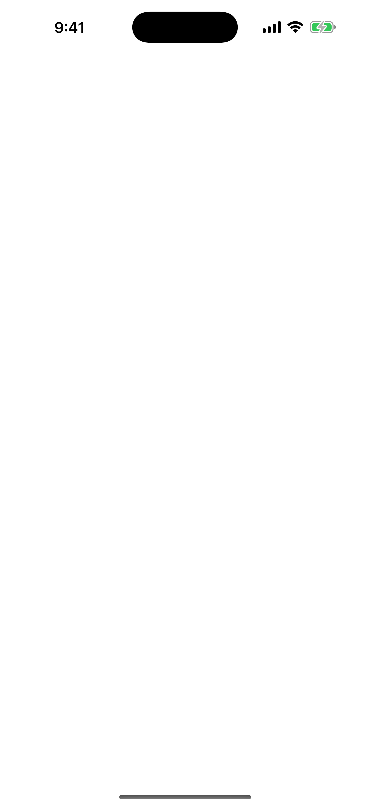

# Tertiary LMS — native iOS app

A SwiftUI iPhone and iPad companion for [AI-LMS-TMS](https://github.com/alfredang/AI-LMS-TMS), restricted to registered learners and trainers.

- Email OTP with single-use, expiring codes and server-side attempt limits.
- Keychain session storage and server-side logout.
- Assigned courseware, learner guides, activities and trainer-only slides.
- A role-specific Learning Passport / Session Command Centre tied to academy assignments.
- Secure on-device tracking of which learner or trainer materials have been opened.
- Singapore-time class calendar and Apple Calendar export.
- APNs reminders three days and one day before each published class session.
- Native Feedback, About, notification settings and account deletion.
- Clearly labelled sample learner/trainer experiences for App Review.

## Build

Requires Xcode 26 and XcodeGen. Minimum iOS 17.

```sh
xcodegen generate
xcodebuild -project TertiaryLearning.xcodeproj -scheme TertiaryLearning -destination 'platform=iOS Simulator,name=iPhone 17 Pro Max' test
```

`project.yml` is the project source of truth. Bundle ID: `com.tertiaryinfotech.ailmstms`. Apple team: `GU9WTSTX9M`.

## Backend

The isolated `backend/` checkout contains the companion changes to AI-LMS-TMS. Mobile routes derive identity from a verified server-side session and validate the selected role. No user IDs from the device are trusted for data access.

`/api/mobile/auth` sends and verifies OTPs; `/me`, `/dashboard`, `/device` and `/delete-account` serve the native app. `/send-reminders` accepts only the configured machine API key. Read [the backend configuration guide](https://github.com/alfredang/AI-LMS-TMS/blob/main/docs/mobile-ios.md) for configuration and verification. The backend is a separate repository and is intentionally excluded from this app repository.

## Release

This repository contains the iOS app source only. Build output, App Store submission tooling and internal release records are intentionally excluded, as is the backend, which lives in its own repository. Never commit `.env`, signing keys or provisioning profiles.

## Preview


